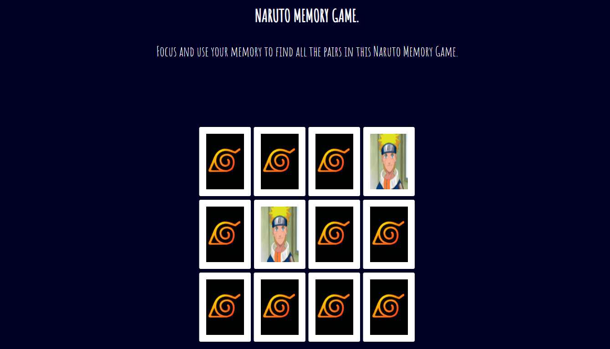

# Front-end Project: Naruto Memory Game

This project is a front-end application developed as part of the Bootcamp TQI Fullstack Developer - DIO. The goal of the project was to create a memory game based on the Naruto anime using JavaScript, HTML, and CSS.

## Features

- Memory Game: The application provides a memory game where players need to match pairs of Naruto anime-themed cards.
- Card Design: The cards are designed with images of characters from the Naruto anime series, creating an immersive experience for the players.
- Timer: The game includes a timer to track the player's progress and challenge them to complete the game in the shortest time possible.
- Score Tracking: The application keeps track of the player's score, counting the number of moves taken to complete the game.

## Technologies Used

The following technologies were used in this project:

- JavaScript: JavaScript is a popular programming language used for web development.
- HTML: HTML is the standard markup language for creating web pages.
- CSS: CSS is a style sheet language used for describing the look and formatting of a document written in HTML.

## How to Play

1. Clone the repository to your local machine.
2. Open the `index.html` file in a web browser.
3. The game board will display a set of face-down cards.
4. Click on any card to reveal its hidden image.
5. Click on another card to find its matching pair.
6. If the images match, the cards will remain face-up.
7. If the images do not match, the cards will flip back face-down.
8. Continue flipping cards until all pairs are matched.
9. The game ends when all pairs are matched.
10. Try to complete the game in the fewest moves and shortest time possible.

## Development

To modify and enhance the game, follow these steps:

1. Clone the repository to your local machine.
2. Open the project directory in your preferred code editor.
3. Modify the JavaScript, HTML, and CSS files to make changes to the game.
4. To add a new image, place the image file in the same directory as the HTML file.
5. Update the HTML file to reference the new image using the appropriate HTML element (e.g., ``).
6. Test the changes in a web browser.
7. Commit and push your changes to the repository.

## Contributions

Contributions to the project are welcome. If you find any issues or have suggestions for improvements, feel free to open an issue or submit a pull request on the project's GitHub repository.

## License

This project is licensed under the [MIT License](LICENSE).
